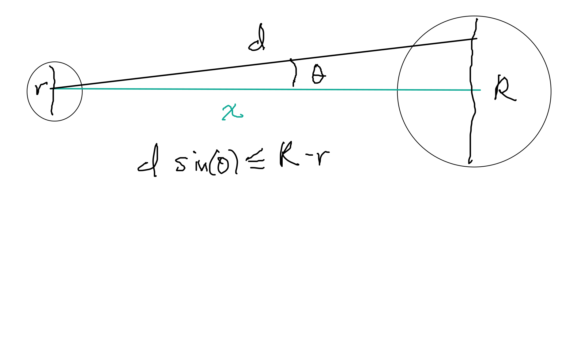

Este es una aplicación de un flujo de trabajo bayesiano tomado del
documento de Michael Betancourt 
que se puede consultar
[aquí](https://betanalpha.github.io/assets/case_studies/principled_bayesian_workflow.html)

El modelo y los datos son [el caso de estudio de Gelman](http://www.stat.columbia.edu/~gelman/research/published/golf.pdf)

```{r}
library(cmdstanr)
library(posterior)
#library(rstan)
library(tidyverse)
```
Los pasos en cada iteración de modelación son:

1. Análisis conceptual
2. Definir el espacio de observaciones
3. Proponer estadísticas resumen
4. Desarrollo del modelo
5. Proponer functiones resumen
6. Simular el ensemble bayesiano (a priori)
7. Verificaciones para la a priori
8. Configurar el algoritmo
9. Ajustar al ensemble simulado
10. Calibración algorítmica
11. Calibración inferencial
12. Ajustar el mdoelo a los datos obervados
13. Diagnosticar el ajuste posterior
14. Verificación posterior predictiva (o dentro de muestra)

# Primera iteración


## Análisis conceptual

Queremos entender modelar la probabilidad de éxito de putts de Golf (putts: tiros
relativamente cerca del hoyo que buscan que la pelota ruede al hoyo o muy 
cerca de él), y cómo depende el éxito de la distancia del tiro. Quisiéramos
inferir qué tan precisos son los profesionales en sus tiros.

El diámetro de una pelota de golf y el hoyo (en centrímetos) es de

```{r}
diam_pelota <- (1.68 * 2.54) %>% round(1)
diam_hoyo <- (4.25 * 2.54) %>% round(1)
c(diam_pelota, diam_hoyo)
```
Los greens de golf (áreas cerca del hoyo) se supone que son perfectamente planas,
de modo que el éxito depende de tirar la pelota con un ángulo suficientemente cercano
a cero con
respecto a la línea que va del centro de la pelota al centro del hoyo.

Supongamos que la distancia del centro de la pelota al centro del hoyo es $x$, y que 
$\theta$ es el ángulo del tiro con respecto a la recta que va del centro de la pelota
al centro del hoyo. El tiro es exitoso cuando

$$\tan(\theta) < \frac{R - r}{2x}$$
Por simetría, sólo consideramos $\theta$ con valores positivos (aunque puede
ser que algunos golfistas tengan fallas asimétricas, eso lo discutimos más adelante).


En particular para nuestro problema, la condición de éxito es

$$\tan(\theta) < \frac{3.25}{x}$$

Mejores golfistas tendrán mejor control sobre $\theta > 0$, y conforme
$x$ es más grande, 

```{r}
tibble(x = seq(20, 500, 1)) %>% 
  mutate(theta = (180 / pi) * atan(3.25 / x)) %>% 
ggplot(aes(x, theta)) + geom_point() +
  xlab("Distancia (cm)") +
  ylab(expression(paste("Desviación máxima ", theta))) +
  labs(subtitle = "Desviación máxima permitida para tener éxito a distintas distancias")
```

La tasa de éxito dependerá de la distancia al hoyo, y del ángulo de cada tiro.
Algunas observaciones:

- No sabemos si con tiros más largos la desviación aumenta (son tiros más fuertes)
o si se mantiene constante. En principio supondremos que no existe un efecto importante
en este sentido. 

- Alternativamente, puede ser que en tiros largos también haya fallos por distancia
que reduzcan la probabilidad de tener éxito, aunque el ángulo sea correcto. 

- Esta curva puede variar dependiendo del jugador, pero vamos a modelar el conjunto
de tiros de profesionales. Suponeoms homogeneidad que podríamos checar con
datos desagregados por jugador. Estos datos podrían tener sobrerrepresentación
de tiradores malos (que quizá hacen más tiros).


## Espacio de observaciones

Usaremos datos de tiros de profesionales que incluyen la distancia al hoyo
y si el tiro fue exitoso o no.

El espacio de observaciones que esperamos del tipo $(x, y)$ donde $x$ es la
distancia del putt y $y$ indica si se logró o no. Probablemente tendremos
los datos agregados: para cada distancia aproximada $x$ tendremos un conteo
de intentos y éxitos sobre los tiros de los jugadores profesionales.

```{r}
read_lines("stan/ajuste_datos.stan", skip = 5, n_max = 6) %>% cat(sep = "\n")
```
## Estadísticas resumen

Tendremos que considerar el porcentaje de éxito para cada distancia. Podemos
separar los datos en incrementos de 50 cm aproximadamente. 

## Desarrollo del modelo

Consideraremos que las observaciones de éxitos a una distancia de $x$ metros es

$$e(x) \sim \textrm{Binom}(n(x), p(x))$$
donde no conocemos $p(x)$. La probabilidad de éxito depende de los ángulos
que se observen en los tiros. Empezamos poniendo

$$\theta \sim N^+(0,\sigma),$$
que expresa nuestra incertidumbre acerca de la desviación promedio $\theta$ que logran
los jugadores profesionales. La probabilidad de éxito es entonces

$$p(x) = P(\tan(\theta) < 3.25/x) = P(\theta < \arctan(3.25/x))$$
De modo que 
$$p(x) = P(Z^+ <  \frac{\arctan(3.25/x)}{\sigma})$$
y entonces

$$p(x)= 2\Phi \left(\frac{\arctan(3.25/x)}{\sigma}\right ) - 1$$
donde $\Phi$ es la distribución acumulada de la normal estándar.

Ahora: no conocemos el valor de $\sigma$, así que tenemos que poner
alguna información acerca de este valor para el cual no tendremos mediciones.
En este punto es necesario consultar con algún experto.

Un experto nos informa que es raro los tiradores profesionales rara vez
exceden más de 4 grados a partir de la línea que quieren tirar, y sabemos
que la desviación promedio no puede ser muy cercana a cero, pues siempre
existen fallas, especialmente más allá de 1 metro de distancia. Una desviación estándar
de los tiros debería estar entre 0.5 y 2.5, por ejemplo. Por el momento
no consideramos que esto pueda variar en función de la distancia. Así que
ponemos 
$$\sigma \sim Gamma(a, b)$$
y tenemos que establecer $a,b$ de forma la mayor parte de la probabilidad
esté entre 0.1 grados y 3 grados de desviación

```{r, fig.width=4, fig.height=2.5}
set.seed(11882)
qplot((180 / pi) * rgamma(5000, 12, 500))
qgamma(c(0.01, 0.99), 12, 500) * (180/pi)
```


Hemos incluido información acerca del problema:

- El modelo de las observaciones y los mecanismos subyacentes
- Distribuciones iniciales consistentes con el conocimiento que tenemos acerca 
del proceso.

## Funciones resumen

Podemos usar cómo resumen las curvas de éxito a cada distancia. Esperamos
que la tasa de éxito a menos de 50 cm sea muy cercana a 1, y la de 6 metros
por abajo del 25%.

Más detalladamente, usaremos esta función para examinar curvas de éxitos:


```{r}
construir_curvas <- function(fit, sim_data){
  sims_df <- fit$draws(c("sigma", "exitos")) %>% as_draws_df() %>%
    as_tibble() %>% 
    rename(rep = .iteration) %>% 
    select(-.chain, -.draw)
  nombres <- colnames(sims_df %>% select(-rep, -sigma))
  distancias <- tibble(name = nombres, dist = sim_data$x)
  exitos <- sims_df %>% 
    pivot_longer(cols = -c("rep", "sigma")) %>% 
    left_join(tibble(n_intentos = sim_data$n, name = nombres), by = "name" ) %>%
    left_join(distancias, by = "name") %>% 
    mutate(prop_exitos = value / n_intentos)
  exitos
}
```


## Simular el ensemble bayesiano

Ahora simualmos en ensamble bayesiano. Escogemos algunas distancias
en centímetros y un número de intentos a cada distancia. Esperamos
encontrar menos tiros a distancias más grandes. Si este fuera un experimento
diseñado, quizá tendríamos el número de intentos en cada distancia predefinida.

```{r}
R <- 1000
sim_data <- list(p = 7, x = c(50, 100, 200, 300, 400, 500, 600), 
                 n = c(500, 500, 300, 200, 100, 50, 50),
                 gamma_sigma = c(12, 500))
ruta <- file.path("stan/simular_ensemble.stan")
mod_sim <- cmdstan_model(ruta)
fit <- mod_sim$sample(
    data = sim_data,
    iter_sampling = R, iter_warmup = 0, 
    chains = 1,
    refresh = R, seed = 432,
    fixed_param = TRUE
)
```

## Verificación a priori

En primer lugar, la media de número de éxitos se ve razonable:

```{r}
fit
```

Podemos examinar con más cuidado. 
Juntamos la información y examinamos los resultados según nuestras
función resumen. En  este caso examinamos las curvas de éxito.


```{r}
exitos <- construir_curvas(fit, sim_data)
g_1 <- ggplot(exitos %>% filter(rep < 1050), 
       aes(x = dist, y = prop_exitos, group = rep)) +
  geom_line(alpha = 0.1)
g_2 <- ggplot(exitos, aes(x = factor(dist), y = prop_exitos)) +
  geom_boxplot()
g_2
```
En este punto podemos consultar con el experto para verificar que:

- No existen realizaciones imposibles (por ejemplo, 100% de éxito para todas las distancias, 50% de éxitos para tiros de 50 cm, etc.)
- El espacio de realizaciones cubre apropiadamente el rango de posibilidades
que el experto considera factible.

### ¿Cómo se ve un error en este punto?

Supongamos que decidimos usar una gamma poco informativa para la desviación
$\sigma$ del ángulo.

```{r}
qplot(rgamma(1000, 0.1, 0.1)) 
```


```{r}
sim_data_error_1 <- list(p = 7, x = c(50, 100, 200, 300, 400, 500, 600), 
                 n = c(500, 500, 300, 200, 100, 50, 50),
                 gamma_sigma = c(0.1, 0.1))
fit_error_1 <- mod_sim$sample(
    data = sim_data_error_1,
    iter_sampling = R, iter_warmup = 0, 
    chains = 1,
    refresh = R, seed = 432,
    fixed_param = TRUE
)
exitos_error_1 <- construir_curvas(fit_error_1, sim_data_error_1)
g_2 <- ggplot(exitos_error_1, aes(x = factor(dist), y = prop_exitos)) +
  geom_boxplot()
g_2
```


Este resultado es pobre y contradice al sentido común y 
conocimiento del dominio. No es posible
que a 6 metros la probabilidad de éxito sea de 1, y tampoco que a 50 centímetros
tengan tasas de éxito de 25%. Si tenemos este tipo de falla, debemos
regresar a los pasos anteriores para corregir el modelo.


## Ajustar al ensemble simulado

Ahora probamos ajustar el modelo a las simulaciones. En este paso tenemos
qué checar qué puede pasar incluso con las condiciones más extremas 
que creemos que podemos encontrar. Usamos la siguiente función
que también calcula algunos resúmenes y diagnósticos que usaremos después:

```{r}
thin <- function(x, k = 1){
  x[seq(1, length(x), by = k)]
}
exitos_obs <- fit$draws("exitos")
sigma <- fit$draws("sigma")
file <- file.path("./stan/ajuste_datos.stan")
modelo <- cmdstan_model(file)
ajustar_modelo <- function(rep, exitos_obs, sigma, modelo, data){

  datos_stan_1 <- list(p = data$p, n = data$n, x = data$x, 
                gamma_params = data$gamma_sigma, 
                exitos_obs = exitos_obs)

  ajuste <- modelo$sample(data = datos_stan_1, 
                          seed = 22103,
                          iter_sampling = 2000, iter_warmup = 1000,
                          refresh = 0, 
                          show_messages = FALSE)
  suppressMessages(diagnostico <- ajuste$cmdstan_diagnose())
  if(diagnostico$status != 0){
    print(diagnostico)
  }
  sigma_sim <- ajuste$draws("sigma") %>% as.numeric %>% thin(., k = 10)
  sbc_rank <- mean(sigma < sigma_sim)
  suppressMessages(resumen <- ajuste$summary())
  tibble(rep = rep, sigma = sigma, sbc_rank = sbc_rank, resumen = list(resumen))
}
```

## Calibración algorítmica


```{r, message=FALSE, warning = FALSE, include = FALSE}
ajustes <- map(1:50, 
               ~ ajustar_modelo(rep = .x, 
                                exitos_obs = exitos_obs[.x, 1, ] %>% as.numeric, 
                                sigma = sigma[.x, 1, ] %>% as.numeric, 
                                modelo = modelo, sim_data)) %>% 
  bind_rows()
```

No tenemos diagnósticos de problemas. Ahora checamos si recuperamos 
el parámetro sigma:
-
```{r}
ggplot(ajustes, aes(sample = sbc_rank)) + 
  geom_qq(distribution = stats::qunif) +
  geom_qq_line(distribution = stats::qunif, colour = "red")
```

Sea $X\sim F$. Entonces la variable $U = F(X)$ tiene distribución uniforme. Razón:
$$P(U < u) = P(F(X) < u) = P(X < F^{-1}(u)) = F(F^{-1}(u)) = u$$

Para el ensemble tenemos más de una distribución, y se satisface esta propiedad para
cada una de ellas. Cuando $X\sim F_\sigma$, con $\sigma\sim G$ entonces igualmente
se satisface que $U = F_\sigma (X)$ es uniforme. 

- Si esta distribución es cercana a la uniforme, significa que *recuperamos* los valores que pusimos en la simulación. 
- No hubo problemas numéricos reportados (checar divergencias, tamaños efectivos
de muestra chicos, las cadenas no mezclan, etc.) Podemos hacer también un examen
más detallado de cómo se ven las simulaciones.
 
## Calibración inferencial

En el siguiente paso vemos las posibilidades de aprendizaje que nos da el modelo.
En este punto, quisiéramos saber si aprendemos algo por encima de lo que ya 
sabíamos.

- Esto se mide con la **contracción**: cómo se compara la incertidumbre a priori
con la posterior. Si la contracción es baja, el modelo está mal identificado o
mal especificado. Comparamos las medias posteriores con el verdadero valor para diagnosticar si es solo mala identificación (estas dos medias son similares), o mal
espcificación (están concentradas en lugares diferentes)

- Cuando la contracción es alta, quiere decir que aprendemos del parámetro de
interés. Sin embargo, si las posteriores varían mucho en dónde están concentradas
en comparación a los verdaderos valores, esto indica sobreajuste (es variabilidad
inducida por los datos).


```{r}
prior_sd_sigma <- sd(rgamma(1000,12, 500))
calib_inf <- ajustes %>% 
  mutate(post_media_sigma = map_dbl(resumen, ~filter(.x, variable=="sigma") %>% pull(mean)),
         post_sd_sigma = map_dbl(resumen, ~ filter(.x, variable == "sigma") %>% pull(sd))) %>% 
  mutate(z_score = (post_media_sigma - sigma) / post_sd_sigma) %>% 
  mutate(contraccion = 1 - (post_sd_sigma/prior_sd_sigma)^2)
```

```{r}
ggplot(calib_inf, aes(x = contraccion, y = z_score)) + geom_point(alpha = 0.5) +
  xlim(c(0, 1))
```
- La contracción es fuerte, de forma que es muy informativa la verosimilitud
- Los valores z están concentrados en 0, de modo que las posteriores capturan
la configuración del modelo.
- Valores $z$ que consistentemente comunmente fuera del rango $[-3,3]$ por ejemplo,
son indicaciones de sobreajuste si la concentración es alta

### Ajuste a las observaciones

Una vez que pasamos las pruebas anteriores, podemos ajustar a los datos
observados reales, que son:

```{r}
datos <- read_delim("../../datos/golf.csv", delim = " ")
datos <- datos %>% mutate(x = round(30.84 * x, 0))
datos
```


```{r}
datos_stan <- list(p = nrow(datos), x = as.integer(datos$x), 
                   n = as.integer(datos$n), gamma_params = c(12, 500),
                   exitos_obs = datos$y)
ajuste <- modelo$sample(data = datos_stan, 
                        seed = 22103,
                        iter_sampling = 4000, iter_warmup = 2000,
                        refresh = 500, init = 1.0, show_messages = FALSE)
ajuste$cmdstan_diagnose()
```

```{r}
ajuste$summary()
```

# Verificación posterior dentro de muestra

Ahora podemos hacer la verificación más básica, que compara el ajustado
con los valores reales. Esto nos indica problemas de desajuste que
requieren reevaluar nuestro modelo. Estas verificaciones también se pueden
hacer *fuera de la muestra* (predictivas), lo cual es más apropiado en algunos
contextos (por ejemplo, si el propósito principal es predecir).

```{r}
sigmas <- ajuste$draws(c("sigma")) %>% as_draws_df() %>% pull(sigma)
prob_exito <- function(x, sigma){
  2 * pnorm(atan(3.25 / x), 0, sigma) - 1;
}
pred_check_tbl <- tibble(sigma = sigmas) %>% 
  mutate(data = map(sigma,  function(sigma){
    datos %>% mutate(prob = prob_exito(x, sigma )) %>% 
      mutate(obs_sim = rbinom(length(n), n, prob) / n)
  })) %>% 
  unnest() %>% 
  group_by(x) %>% 
  summarise(q_05 = quantile(obs_sim, 0.05), q_95 = quantile(obs_sim, 0.95),
            y = first(y), n =first(n))
g_post <- ggplot(pred_check_tbl, aes(x= factor(x))) +
  geom_linerange(aes(ymin = q_05, ymax = q_95)) +
  geom_point(aes(y = y/n), colour="red", size = 2) +
  ylim(c(0,1)) + xlab("Distancia (cm)") + ylab("Tasa de éxito")
g_post 
```
El ajuste es razonable, pero observamos algunos patrones de desajuste. 
Quizá hay cierto patrón en que a distancias mayores de 2 metros
las predicciones tienden a ser altas. Esto indica que es posible que
haya 

- cierta degradación del ángulo de tiro para distancias más grandes
- Pueden ser fallas de potencia también.

Resolver esto requiere tener más información acerca de cómo fallan los tiros
a larga distancia: ¿es el ángulo o la potencia? En ese caso, repetimos el ciclo
de construcción del modelo.

Finalmente, evaluamos el parámetro de interés. ¿Qué tanto se desvían
de la línea recta los jugadores profesionales?

```{r}
sigmas_grados <- (180/pi) * sigmas
qplot(sigmas_grados)
```

La desviación estándar es e 1.5 grados. Burdamente (solo tomamos la media posterior), así se ve la distribución
de desviaciones a lo largo de tiros:

```{r}
qplot(rnorm(10000, 0, 1.5)) + xlab("Desviación en grados")
```


# Segunda iteración: distancia y ángulo

