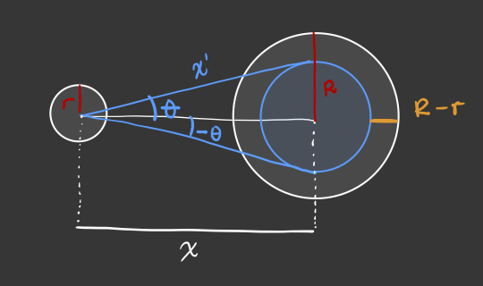

Este caso está basado en @GelmanNolan y @GolfCase. A lo largo de este ejemplo
ilustraremos los pasos de un flujo de trabajo para modelado Bayesiano.
En paralelo discutiremos los conceptos clave para guiar el desarrollo de modelos
y este caso servirá como breve introudcción al lenguaje de programación
probabilistica `Stan` [@stan]. 
En particular usaremos el flujo de trabajo bayesiano tomado del documento de
@BetancourtCase y posteriormente refinado en el artículo @bayesworkflow.


```{r setup, include=FALSE, message=FALSE}
library(cmdstanr)
library(posterior)
library(bayesplot)
library(tidyverse)
library(patchwork)
source("../../funciones-auxiliares/simular_resumenes.R")

print_file <- function(file) {
  cat(paste(readLines(file), "\n", sep=""), sep="")
}

knitr::opts_chunk$set(echo = TRUE, cache = TRUE, comment = "",
                      fig.align = "center", out.width = "75%")

comma <- function(x) format(x, digits = 2, big.mark = ",")
remove.warnings <- function(){assign("last.warning", NULL, envir = baseenv())}
theme_set(theme_linedraw())
```

## Definición del problema

Queremos entender y modelar la probabilidad de éxito de *putts* de Golf
(*putts*: tiros relativamente cerca del hoyo que buscan que la pelota ruede al
hoyo o muy cerca de él), y cómo depende el éxito de la distancia del tiro. Como
conclusiones quisiéramos inferir qué tan precisos son los profesionales en sus
tiros.

Para este estudio tenemos disponible el siguiente conjunto de datos @GelmanNolan. 

**Definición.** El espacio de observaciones que esperaríamos son del tipo $(x, y)$
donde $x$ es la distancia del *putt* y $y$ indica si se logró o no. Sin embargo,
los datos que tenemos son agregados: para cada distancia aproximada $x_j$
tendremos un conteo de intentos $n_j$ y éxitos $y_j$ sobre los tiros de los
jugadores profesionales. En total las distancias han sido redondeadas y
obtenemos $J = 19$ distancias distintas.


```{r, echo = FALSE, message= FALSE}
datos <- read_delim("datos/golf.csv", delim = " ")
datos <- datos %>% 
  mutate(x = round(30.48  * x, 0), 
         se = sqrt((y/n)*(1-y/n)/n))

g_datos <- datos %>% 
  ggplot(aes(x = x, y = y/n)) + 
    geom_linerange(aes(ymin = y/n - 2 * se, ymax = y/n + 2*se)) + 
    geom_point(colour = "steelblue", alpha = 1.) + 
    ylim(c(0,1)) + xlab("Distancia (cm)") + ylab("Tasa de éxito") + 
    ggtitle("Datos sobre putts en golf profesional")

g_datos
```

Los puntos muestran las tasas de éxito para cada intento de tiro como función
de la distancia a la meta. Las barras indican intervalos de confianza al 95\%
utilizando el error estándar clásico $\sqrt{\hat p_j (1- \hat p_j)/n_j},$ donde
$\hat p_j = y_j / n_j.$

### Modelo logístico 

Un primer intento es modelar la probabilidad de éxito a través de una regresión
logística.
$$y_j \sim \mathsf{Binomial}\left(n_j, \text{logit}^{-1}(a + b x_j)\right),$$
para cada $j = 1, \ldots, J.$ Este modelo lo escribimos en `Stan` como sigue 
```{r, echo=FALSE, message=FALSE, warning = FALSE}
print_file("modelos/regresion_logistica.stan")
```
Notemos que no hemos especificado una distribución inicial explícita para
nuestros parámetros. Por default `Stan` está incorporando una distribución
*plana* en todo el espacio $(a,b) \in \mathbb{R}^2.$ Podríamos debatir si esto
es aceptable y las consecuencias de incluir una distribución inicial de esta
naturaleza. 

Compilamos el modelo para poder utilizarlo. 
```{r}
ruta <- file.path("modelos/regresion_logistica.stan")
modelo <- cmdstan_model(ruta)
```
Ahora podemos ajustar a los datos observados. `Stan` en general recibe los datos
como una lista con nombres. Utilizando nuestra función `ajustar_modelo` podemos
simular 1,000 iteraciones de la posterior bajo muestreo utilizando una variante
`HMC` llamada `NUTS` (*No U-Turn Sampler*).

```{r, message=FALSE, warning=FALSE}
data_list <- c(datos, list("J" = nrow(datos)))
ajuste <- ajustar_modelo(modelo, data_list)
```

Parece que el muestreador no tuvo problemas en correr y podemos checarlo con la
función de
[diagnóstico](https://mc-stan.org/docs/2_25/cmdstan-guide/diagnose.html). Más
adelante estudiaremos los diágnósticos que utilizamos para evaluar modelos.

```{r}
ajuste$cmdstan_diagnose()
```

Más aún, podemos pedir el resumen del ajuste donde leemos estadisticas de
interes como media, mediana, desviación estándar e intervalos de credibilidad
del 90\%.
```{r}
ajuste$summary(c("a", "b"))
```
Podemos extraer las muestras de cada parámetro por medio de la librería
`posterior`
```{r}
muestras <- tibble(posterior::as_draws_df(ajuste$draws(c("a", "b"))))
```
y utilizar distintos diagnósticos gráficos como
```{r}
muestras %>% 
  pivot_longer(cols = c(a, b), names_to = 'parameter') %>% 
  mutate(Chain = as.factor(.chain)) %>% 
  ggplot(aes(x = .iteration, y = value)) + 
    geom_line(aes(group = .chain, color = Chain)) + 
    facet_wrap(~parameter, ncol = 1, scales = 'free', strip.position="right") + 
    scale_color_viridis_d(option = 'plasma')
```

De igual forma podríamos calcular el máximo de la posterior (que en este caso
coincide con el MLE) mediante
```{r, message = FALSE, warning = FALSE}
params_map <- modelo$optimize(data = data_list, seed = 108)
params_map <- params_map$summary() %>% 
  pivot_wider(values_from = estimate, names_from = variable)
params_map
```

Salvo algunos mensajes de error en la inicialización en la optimización parece
ser que tenemos un modelo bien comportado. Podríamos explorar un gráfico de
dispersión para visualizar la correlación posterior de nuestros parámetros y
ubicar el valor que maximiza la pseudo-posterior.
```{r, warning = FALSE}
muestras %>% 
  ggplot(aes(x = a, y = b)) + 
  geom_point() + 
  geom_point(data = params_map, aes(x = a, y = b),
             color = 'salmon', shape = 4, stroke = 2) + 
  ggtitle('Muestras de la posterior')
```

```{r, cache = TRUE}
logit <- qlogis
invlogit <- plogis

modelo_logistico <- function(a, b){
  x <- seq(0, 1.1 * max(datos$x), length.out = 50)
  tibble(x = x, y = invlogit(a *x + b))
}

curvas_regresion <- muestras %>% 
  mutate(curva = map2(a, b, modelo_logistico)) %>% 
  select(-a, -b) %>% 
  unnest(curva) %>% 
  group_by(x) %>% 
  summarise(mediana = median(y), 
            q_low = quantile(y, .005), 
            q_hi = quantile(y, .995), 
            .groups = 'drop')

g_logistico <- datos %>% 
  ggplot(aes(x = x, y = y/n)) + 
    geom_linerange(aes(ymin = y/n - 2 * se, ymax = y/n + 2*se)) + 
    geom_point(colour = "steelblue", alpha = 1.) + 
    geom_line(data = curvas_regresion, aes(x = x, y = mediana)) +
    geom_ribbon(data = curvas_regresion, aes(x = x, ymin = q_low, ymax = q_hi), 
                alpha = .2, inherit.aes = FALSE) +
    ylim(c(0,1)) + xlab("Distancia (cm)") + ylab("Tasa de éxito") + 
    ggtitle("Regresion logística ajustada")

g_logistico

muestras_logistico <- muestras
```

La línea solida representa la mediana de la curva de regresión calculada entre
las muestras de la posterior obtenidas. La región sombreada corresponde a la
banda del 99\% de credibilidad calculada a partir del mismo conjunto de
muestras.

El modelo es razonable, en el sentido de que los parámetros tienen los valores
que esperaríamos. La pendiente del modelo de regresión logística es negativa, lo
cual interpretamos como la falta de precisión del tirador mientras mas alejado
del hoyo. Mientras que para el caso base ($x = 0$) el modelo da una probabilidad
de éxito relativamente alta.

En las siguientes secciones ilustraremos el procedimiento para complementar el
modelo.

### Análisis conceptual

Podemos pensar en cada intento que hace un golfista como una prueba
independiente que puede resultar en éxito o fracaso. El modelo anterior estable
la probabilidad de éxito como una función no lineal de la distancia.

El problema es considerablemente complicado conceptualmente (@HolmesGolf,
@PennerPutting) si consideramos todas las fuentes de variación: ángulo de tiro,
potencia de tiro, declive en greens y así sucesivamente. Los supuestos que
debemos criticar son:

Seguiremos haciendo la simplificación de superficie plana, pero consideramos
dos parámetros para el tiro con distintas condiciones de éxito:

1. El ángulo del tiro.
2. La velocidad con la que la pelota llega (o no llega) al hoyo.

Los radios de una pelota de golf y el hoyo (en centímetros) es de

```{r}
radios <- tibble(pelota = (1.68/2 * 2.54) %>% round(1), 
                  hoyo  = (4.25/2 * 2.54) %>% round(1))

radios
```

Supondremos por el momento que los *greens* de golf (áreas cerca del hoyo) 
son perfectamente planos (lo cual no es cierto, pero refinaremos después),
de modo que el éxito depende de:

1. Tirar la pelota con un ángulo suficientemente cercano a cero con respecto a
la línea que va del centro de la pelota al centro del hoyo.
2. Tirar la pelota con una velocidad suficiente para que llegue al hoyo pero no
tan alta que vuele por encima del hoyo.

Mejores datos de los tipos de fallo sería útil, pero por el momento no los
tenemos disponibles.

#### Ángulo de tiro

Supongamos que la distancia del centro de la pelota al centro del hoyo es $x.$ 
Idealmente ésta es la trayectoria que el golfista tendría que ejecutar. Sin
embargo, el tiro puede ser inexacto y denotamos por $\theta$ el ángulo del tiro
realizado. El tiro es exitoso cuando el angulo de tiro satisface
$$|\theta| < \tan^{-1}\left(\frac{R - r}{x}\right).$$
Incorporamos un esquema de esta situación a continuación. 

```{r, echo = FALSE, fig.cap="Esquema de ángulo de tiro"}

```


**Observación.** Aqui hemos hecho un supuesto importante. La distancia reportada
en los datos, la cual hemos denotado por $x,$ es la distancia entre el centro de
la pelota y el centro del hoyo. ¿Cómo cambiaría nuestra condición de éxito si
suponemos que la distancia que viaja la pelota es la registrada, es decir si
ésta correspondiera a $x'$ en nuestro esquema?

En particular para nuestro problema, la condición de éxito es
$$|\theta| < \tan^{-1}\left( \frac{3.3}{x} \right)$$

Mejores golfistas tendrán mejor control sobre $\theta$, y conforme
$x$ es más grande, la probabilidad de tener éxito baja:

```{r}
tibble(x = seq(10, 1500, 1)) %>% 
  mutate(theta = (180 / pi) * atan(3.3 / x)) %>% 
ggplot(aes(x, theta)) + geom_line() +
  xlab("Distancia (cm)") +
  ylab(expression(paste("Desviación máxima |", theta,"|"))) +
  labs(subtitle = "Desviación máxima permitida para tener éxito a distintas distancias") +
  scale_y_log10()
```

**Observación.** Esta curva puede variar dependiendo del jugador, pero vamos a
modelar el conjunto de tiros de jugadores profesionales. Suponemos homogeneidad,
misma que podríamos checar con datos desagregados por jugador. Estos datos
podrían tener sobre-representación de tiradores malos (pues quizá hacen más
tiros).

Para modelar $\theta$ de manera probabilista asumimos una distribución Gaussiana
con desviación estándar $\sigma.$ Este modelo codifica nuestra suposición de que
los jugadores en promedio tirarán de manera recta, sin embagro puede haber
diversos factores que afectarán este resultado.

Siguiendo esta distribución, la probabilidad de éxito se calcula como 
$$\mathbb{P}\left\{\,  |\theta| <  \tan^{-1}\left( \frac{R - r}{x} \right)\right\} = 2 \, \Phi\left[ \frac{\tan^{-1}((R - r)/x)}{\sigma}\right] - 1,$$
donde $\Phi$ es la función de acumulación de una Normal estándar.

La figura siguiente muestra las curvas de probabilidad para distintos valores
de $\sigma$ para distintos valores de la distancia al hoyo. 

```{r, echo = FALSE}
curva_angulo <- function(sigma){
  x <- seq(0, 650, by = .5)
  R.diff <- radios %>% summarise(diff = hoyo - pelota) %>% pull(diff)
  tibble(x = x, y = 2 * pnorm( (180/pi) * atan(R.diff/x)/sigma) - 1)
}

tibble(sigma = 2**seq(0,5)) %>% 
  mutate(curva = map(sigma, curva_angulo), 
         Sigma = as.factor(sigma)) %>% 
  unnest(curva) %>% 
  ggplot(aes(x = x, y = y)) + 
    geom_line(aes(group = sigma, color = Sigma)) + 
    scale_color_viridis_d() + ylim(c(0,1)) + xlab("Distancia (cm)") + ylab("Probabilidad de éxito") + 
    ggtitle(expression(paste("Probabilidad de éxito para diferentes valores de ", sigma," (en grados ", ~degree, ").")))
```

La curva mas alta de la gráfica corresponde a una desviación estándar de
$1^\circ,$ que implica que un jugoador de golf tendrá en promedio una
probabilidad cercana a $25\%$ cuando se encuentre a 6 metros de distancia;
alrededor de $60\%$ cuando se encuentre a 2 metros, $90\%$ a un metro, etc.

Ahora veamos las distintas realizaciones de tiros a 1 metro de distancia bajo
distintos valores de $\sigma.$

```{r, out.width = "95%", fig.height = 3}
simula_tiros <- function(sigma){
  distancia  <- 1
  n_muestras <- 250
  angulos_tiro <- (pi/180) * rnorm(n_muestras, 0, sigma)
  tibble(x = distancia * cos(angulos_tiro), 
         y = distancia * sin(angulos_tiro))
}

tibble(sigma_grados = c(1, 8, 32, 64)) %>% 
  mutate(tiros = map(sigma_grados, simula_tiros)) %>% 
  unnest(tiros) %>% 
  ggplot(aes(x = x, y = y)) + 
    geom_point() +
    geom_segment(aes(x = 0, y = 0, xend = x, yend = y), alpha = .1) + 
    geom_point(aes(x = 0, y = 0), color = 'red') + 
    facet_wrap(~sigma_grados, ncol = 4) + 
    ylab("") + xlab("") + ggtitle("Posiciones finales de tiro")
  
```

Notamos que los tiros en general tienen un buen comportamiento. Posiblemente
valores de tiros con una desviación de $60^\circ$ dan lugar a tiros que no
tienen sentido. Este punto lo veremos más adelante en caso de que tengamos que
refinar. Por el momento, el modelo queda como sigue
\begin{align}
p_j & =  2 \, \Phi\left( \frac{\tan^{-1}((R - r)/x_j)}{\sigma}\right) - 1,\\
y_j &\sim \mathsf{Binomial}\left(n_j, p_j\right), 
\end{align}
para $j = 1, \ldots, J.$

El modelo en `Stan` lo escribimos como sigue
```{r, echo=FALSE, message=FALSE, warning = FALSE}
print_file("modelos/modelo_angulo.stan")
```

**Observación.** Seguimos sin utilizar una distribución a priori para los
parámetros del modelo. En este caso, el model requiere de especificar una
distribución para la desviación estándar del ángulo de tiro, $\sigma.$ Por el
momento se le ha asignado una distribucion *plana* en $\mathbb{R}^+.$

```{r}
data_list$r = radios$pelota
data_list$R = radios$hoyo

ruta <- file.path("modelos/modelo_angulo.stan")
modelo <- cmdstan_model(ruta)

ajuste <- ajustar_modelo(modelo, data_list)

ajuste$cmdstan_diagnose()

ajuste$summary(c("sigma", "sigma_degrees"))
```

```{r, fig.height = 2}
muestras <- tibble(posterior::as_draws_df(ajuste$draws(c("sigma", "sigma_degrees"))))

muestras %>% 
  select(-sigma_degrees) %>% 
  pivot_longer(cols = c(sigma), names_to = 'parameter') %>% 
  mutate(Chain = as.factor(.chain)) %>% 
  ggplot(aes(x = .iteration, y = value)) + 
    geom_line(aes(group = .chain, color = Chain)) + 
    facet_wrap(~parameter, ncol = 1, scales = 'free', strip.position="right") + 
    scale_color_viridis_d(option = 'plasma')
```
```{r, out.width = "99%", fig.height = 3}
modelo_angulo <- function(sigma_radianes){
  x <- seq(0, 1.1 * max(datos$x), length.out = 50)
  R.diff <- radios %>% summarise(diff = hoyo - pelota) %>% pull(diff)
  tibble(x = x, y = 2 * pnorm( atan(R.diff/x)/sigma_radianes) - 1)
}

curvas_regresion <- muestras %>% 
  mutate(curva = map(sigma, modelo_angulo)) %>% 
  select(-sigma_degrees, -sigma) %>% 
  unnest(curva) %>% 
  group_by(x) %>% 
  summarise(mediana = median(y), 
            q_low = quantile(y, .005), 
            q_hi = quantile(y, .995), 
            .groups = 'drop')

g_angulo <- datos %>% 
  ggplot(aes(x = x, y = y/n)) + 
    geom_linerange(aes(ymin = y/n - 2 * se, ymax = y/n + 2*se)) + 
    geom_point(colour = "steelblue", alpha = 1.) + 
    geom_line(data = curvas_regresion, aes(x = x, y = mediana)) +
    geom_ribbon(data = curvas_regresion, aes(x = x, ymin = q_low, ymax = q_hi), 
                alpha = .2, inherit.aes = FALSE) +
    ylim(c(0,1)) + xlab("Distancia (cm)") + ylab("Tasa de éxito") + 
    ggtitle("Modelo con ángulo de tiro")

g_logistico + g_angulo
```
Por el momento parece que el modelo está haciendo un muy buen trabajo. Parece
ser que no es necesario incluir información previa en los parámetros. 

#### Nuevo conjunto de datos

Después de algunos años se consiguieron mas registros. En particular, el
profesor Broadie fue el que brindo dichos datos. 

```{r, echo = FALSE}
datos_bkp <- datos
```


```{r}
datos_grande <- read_delim("datos/golf_grande.csv", delim = "\t")
datos_grande <- datos_grande %>% 
  mutate(x = dis * 30.48, n = count, y = exitos, se = sqrt((y/n)*(1-y/n)/n), fuente = 1) %>% 
  select(x, n, y, se, fuente)

datos <- rbind(datos %>% mutate(fuente = 0), datos_grande)
datos <- datos %>% mutate(fuente = as.factor(fuente))

curvas_regresion <- muestras %>% 
  mutate(curva = map(sigma, modelo_angulo)) %>% 
  select(-sigma_degrees, -sigma) %>% 
  unnest(curva) %>% 
  group_by(x) %>% 
  summarise(mediana = median(y), 
            q_low = quantile(y, .005), 
            q_hi = quantile(y, .995), 
            .groups = 'drop')

datos %>% 
  ggplot(aes(x = x, y = y/n)) + 
    geom_linerange(aes(ymin = y/n - 2 * se, ymax = y/n + 2 * se)) + 
    geom_point(aes(colour = fuente), alpha = 1.) +
    geom_line(data = curvas_regresion, aes(x = x, y = mediana)) +
    geom_ribbon(data = curvas_regresion, aes(x = x, ymin = q_low, ymax = q_hi),
                alpha = .2, inherit.aes = FALSE) +
    ylim(c(0,1)) + xlab("Distancia (cm)") + ylab("Tasa de éxito") +
    ggtitle("Modelo con ángulo de tiro")

```


<!-- #### Velocidad final -->

<!-- Siguiendo [@PennerPutting], existe un rango de velocidades iniciales que -->
<!-- determinan la condición de éxito. -->

<!-- - La condición de éxito en un tiro recto es que la velocidad final $v_f$ (en -->
<!-- metros por segundo) de la pelota cumpla -->
<!-- $$0 < v_f < 1.63$$ -->
<!-- - La aceleración de la pelota al rodar en el green: -->
<!-- $$a = (10/7)\frac{\rho}{r}g$$ -->
<!-- dond $\rho$ depende de la superficie donde rueda la pelota. Datos experimentales -->
<!-- indican que la media en greens es de $\rho = 0.131, con un rango de 0.065 a -->
<!-- 0.196. -->
<!-- - Tomaremos $\rho = 0.131$ -->

<!-- La velocidad inicial de la pelota en términos de la velocidad inicial, usando -->
<!-- esta aceleración, es -->
<!-- $$v_f^2 = v_0^2 - (10/7)\frac{\rho}{r}gx = v_0^2 - (10/7)\frac{\rho}{4.3}9.8x=v_0^2 - 3.26\rho x$$ -->
<!-- donde $x$ es la distancia de la pelota al hoyo. Ahora podemos despejar para -->
<!-- calcular las condiciones de éxito sobre la velocidad inicial $v_0$: -->

<!-- $$d < v_0^2 < 1.63 + d$$ -->

<!-- donde $d = 3.26\rho x$. La condición de éxito es entonces -->
<!-- $$3.26\rho x < v_0^2 < 1.63 + 3.26\rho x$$ -->

<!-- ```{bash} -->
<!-- sed -n '/^data/,/\}/p' modelos/modelo.stan -->
<!-- ``` -->

<!-- ```{bash} -->
<!-- sed -n '/^transformed/,/\}/p' modelos/modelo.stan -->
<!-- ``` -->

### Desarrollo del modelo

Consideraremos que las observaciones del número de éxitos $e(x)$ a una 
distancia de $x$ metros es

$$e(x) \sim \textsf{Binom}\left(n(x), p(x)\right)$$
La probabilidad de éxito depende de los ángulos y la velocidad inicial que se
observen en los tiros. Comenzaremos suponiendo que la probabilidad de éxito es
el producto de la probabilidad de usar el ángulo en el rango de éxito, por la
probablilidad de usar una velocidad inicial en el rango de éxito:

$$p(x) = p_{ang}(x)p_{dist}(x)$$

Empezamos poniendo
$$\theta \sim N^+(0,\sigma_a),$$
que expresa nuestra incertidumbre acerca de la desviación promedio $\theta$ que logran
los jugadores profesionales. La probabilidad de éxito es entonces

$$p_{ang}(x) = P(\tan(\theta) < 3.25/x) = P(\theta < \arctan(3.25/x))$$
De modo que 
$$p_{ang}(x) = P \left (Z^+ <  \frac{\arctan(3.25/x)}{\sigma_a}\right )$$
y entonces

$$p_{ang}(x)= 2\Phi \left(\frac{\arctan(3.25/x)}{\sigma_a}\right ) - 1$$
donde $\Phi$ es la distribución acumulada de la normal estándar.

Ahora: no conocemos el valor de $\sigma_a$, así que tenemos que poner
alguna información acerca de este valor para el cual no tendremos mediciones.
En este punto es necesario consultar con algún experto.

Un experto nos informa que es raro los tiradores profesionales rara vez
exceden más de 4 grados a partir de la línea que quieren tirar, y sabemos
que la desviación promedio no puede ser muy cercana a cero, pues siempre
existen fallas, especialmente más allá de 1 metro de distancia. Una desviación estándar
de los tiros debería estar entre 0.5 y 2.5, por ejemplo. Por el momento
no consideramos que esto pueda variar en función de la distancia. Así que
ponemos 
$$\sigma_A \sim Gamma(a, b)$$
y tenemos que establecer $a,b$ de forma la mayor parte de la probabilidad
esté entre 1 grado y 4 grados de desviación

```{r}
set.seed(11882)
qplot((180 / pi) * rgamma(5000, 25, 500))
qgamma(c(0.01, 0.99), 25, 500) * (180/pi)
```


Ahora es necesario incluir la información de la velocidad inicial y poner
supuestos de cómo tiran los jugadores de golf. Un supuesto que podemos hacer
es que los jugadores intentan tirar un poco más allá del hoyo, de forma
que la pelota entre con cierta velocidad, por ejemplo, tomando el promedio
de los extremos de éxito, podemos poner
$$v_0^2 = (0.82 + 3.26\rho x)(1 + u)$$
donde $u$ es una variable normal con media cero y desviación estándar $\sigma_{d}$
chica:
$$u \sim N(0, \sigma_{d})$$

Estamos suponiendo que el error es multiplicativo con respecto al momento
que se imparte a la pelota (ver @GolfCase para la idea general).

Según este supuesto, la probabilidad de éxito en términos de la velocidad inicial es

$$2\Phi \left(\frac{0.82}{\sigma_{d} (0.82 + 3.26\rho x)}\right) - 1$$
Para poner una inicial consistente con conocimiento de dominio podemos
calcular la distancia que recorrería la pelota bajo distintos supuestos si no
hubiera hoyo. La distancia total recorrida, por los supuestos de arriba, es:

```{r}
sim_dist_recorrida <- function(x, rho, sigma_dist){
  u <- rnorm(100, 0, sigma_dist)
  dist_recorrida  <- (0.82 + 3.26 * rho * x) * (1 + u) / (3.26 * rho)
  error <- dist_recorrida / x
  error
}
sim_1 <- sim_dist_recorrida(500, 0.131, 0.01) * 500
quantile(sim_1) 
```

Que se ve como sigue para un valor de $\sigma_{dist} = 0.005$ (1% de error)

```{r}
sigma_dist <- 0.005
tibble(x = seq(10, 2000, 10)) %>% 
  mutate(prob_exito = 2*pnorm(0.82 / (sigma_dist * (0.82 + 3.26*(0.131)*x))) - 1) %>% 
ggplot(aes(x = x, y = prob_exito)) + geom_point()
```

Este es un valor que parece ser demasiado grande para $\sigma_d$, pues sugiere
que la mitad de los tiros a 6 metros tienen la potencia incorrecta.

Finalmente, ponemos una distribución inicial para $\sigma_d$. Esta cantidad
puede ser más difícil de elicitar en un experto, pero podemos hacer simulaciones
para ver las consecuencias de nuestras decisiones. Comenzaremos poniendo

$$\sigma_{dist} \sim \textsf{Gamma}(5, 3000)$$
```{r}
c(qgamma(0.01, 5, 3000), qgamma(0.99, 5, 3000)) %>% round(4)
```


Hemos incluido información acerca del problema:

- El modelo de las observaciones y los mecanismos subyacentes
- Distribuciones iniciales consistentes con el conocimiento que tenemos acerca 
del proceso.

### Simular ensamble bayesiano

Ahora simulamos el ensamble bayesiano. Escogemos algunas distancias en
centímetros y un número de intentos a cada distancia. Esperamos encontrar menos
tiros a distancias más grandes. Si este fuera un experimento diseñado, quizá
tendríamos el número de intentos en cada distancia predefinidos. Aunque no es
ideal, en este caso pondremos algunos números de intentos y distancias
hipotéticas para probar nuestros modelos.

```{r}
sim_datos <- jsonlite::read_json("datos/datos_prueba.json", simplifyVector = TRUE)
parametros <- jsonlite::read_json("datos/datos_inicial.json", simplifyVector = TRUE)
print(sim_datos)
```


```{r}
sim_ensemble_datos <- c(sim_datos, parametros)
ruta <- file.path("modelos/simular_ensemble_modelo.stan")
modelo_inicial <- cmdstan_model(ruta)
ensemble <- simular_ensemble(modelo_inicial, sim_ensemble_datos)
```

Y examinamos las siguientes probabilidades de éxito:

```{r}
exitos_tbl <- curvas_exito(ensemble, sim_ensemble_datos)
g_1 <- ggplot(exitos_tbl, aes(x = factor(x), y = prop_exitos)) +
    geom_jitter(alpha = 0.1) 
g_1
```

En este punto podemos consultar con el experto para verificar que:

- Pŕacticamente no consideramos realizaciones imposibles (por ejemplo, 100% de
éxito para todas las distancias, 50% de éxitos para tiros de 50 cm, etc.)
- El espacio de realizaciones cubre apropiadamente el rango de posibilidades
que el experto considera factible.

Nótese también que con estos supuestos estamos afirmando que la mayor parte
de los tiros que se fallan son debidos a un ángulo incorrecto.

### Ajustar al ensemble simulado

Ahora probamos ajustar el modelo a las simulaciones. En este paso tenemos
qué checar qué puede pasar incluso con las condiciones más extremas 
que creemos que podemos encontrar. 

Podemos probar con una simulación:

```{r}
num_iter <- 11
exitos_sim <- ensemble$draws("exitos")
sigma_sim_tbl <- ensemble$draws(c("sigma_ang", "sigma_dist")) %>% as_draws_df()
```


```{r}
ruta <- file.path("modelos/modelo.stan")
modelo <- cmdstan_model(ruta)
```


```{r, message=FALSE, warning=FALSE}
datos_1 <- c(sim_ensemble_datos, list("exitos_obs" = exitos_sim[num_iter, 1, ] %>% as.numeric))
# ajuste <- ajustar_modelo(modelo, datos_1, iter_sampling=4000, iter_warmup = 4000)
ajuste <- ajustar_modelo(modelo, datos_1)
```

```{r}
print(ajuste)
ajuste$cmdstan_diagnose()
```

Este ajuste tuvo problemas. Observamos que tenemos multimodalidad en nuestra posterior:

```{r}
ajuste_draw <- ajuste$draws(c("sigma_dist", "sigma_ang")) %>% as_draws_df
ggplot(ajuste_draw, aes(x = sigma_ang, y = sigma_dist)) + geom_point() +
  geom_point(data = sigma_sim_tbl[num_iter, ], colour = "red")
```
No encontramos divergencias ni problemas numéricos.

### Calibración algorítmica

Ahora veremos si el algoritmo corre sin problemas numéricos con los supuestos
del ensamble inicial. Es necesario repetir con muchas simulaciones, para
entender si algunas configuraciones pueden tener dificultades numéricas.

```{r, warning = FALSE, message = FALSE, include = FALSE, cache = TRUE}
ajustes_ensemble <- 
  map(1:10, ~ ajustar_diagnosticos(.x, 
        modelo = modelo, 
        datos = c(sim_ensemble_datos, list("exitos_obs" = exitos_sim[.x, 1, ] %>% as.numeric)),
        params = sigma_sim_tbl[.x, ] %>% select(-.chain, -.iteration, -.draw) ),
      ) %>%  
        # iter_warmup = 6000, iter_sample = 6000) %>% 
  bind_rows()
```

En algunas corridas obtuvimos problemas numéricos:

```{r}
map(ajustes_ensemble$diagnosticos, "stdout") %>% 
  str_detect("no problems detected") %>% 
  table
```

Ahora checamos que recuperamos los parámetros apropiadamente:

```{r}
sbc_rank_sim <- ajustes_ensemble %>% select(sbc_rank) %>% unnest
g_dist <- ggplot(sbc_rank_sim, aes(sample = sigma_dist)) +
  geom_qq(distribution = stats::qunif) +
  geom_abline() +
  labs(subtitle = "sigma_dist")
g_angulo <- ggplot(sbc_rank_sim, aes(sample = sigma_ang)) +
  geom_qq(distribution = stats::qunif) +
  geom_abline() +
  labs(subtitle = "sigma_angulo")
g_dist + g_angulo
```

La distribución del ranking de las simulaciones con relación a cada parámetro
simulado es cercana a la uniforme

### Calibración inferencial

En el siguiente paso vemos las posibilidades de aprendizaje que nos da el modelo.
En este punto, quisiéramos saber si aprendemos algo por encima de lo que ya 
sabíamos.

- Esto se mide con la **contracción**: cómo se compara la incertidumbre a priori
con la posterior. Si la contracción es baja, el modelo está mal identificado o
mal especificado. Comparamos las medias posteriores con el verdadero valor para
diagnosticar si es solo mala identificación (estas dos medias son similares), o
mal espcificación (están concentradas en lugares diferentes)

- Cuando la contracción es alta, quiere decir que aprendemos del parámetro de
interés. Sin embargo, si las posteriores varían mucho en dónde están concentradas
en comparación a los verdaderos valores, esto indica sobreajuste (es variabilidad
inducida por los datos).


```{r}
prior_sd_sigma <- sd(rgamma(1000, 25, 500))
calib_inf <- ajustes_ensemble %>%
  unnest(cols = (params)) %>% 
  mutate(post_media_sigma = map_dbl(resumen, ~filter(.x, variable=="sigma_ang") %>% pull(mean)),
         post_sd_sigma = map_dbl(resumen, ~ filter(.x, variable == "sigma_ang") %>% pull(sd))) %>% 
  mutate(z_score = (post_media_sigma - sigma_ang) / post_sd_sigma) %>% 
  mutate(contraccion = 1 - (post_sd_sigma/prior_sd_sigma)^2)
```

```{r}
ggplot(calib_inf, aes(x = contraccion, y = z_score)) + 
  geom_point(alpha = 0.5) +
  xlim(c(0, 1))
```

Y obtenemos algunos resultados malos para el parámetro de distancia:

```{r}
prior_sd_sigma <- sd(rgamma(5000, 5, 3000))
calib_inf <- ajustes_ensemble %>%
  unnest(cols = (params)) %>% 
  mutate(problema = map_lgl(diagnosticos, ~ !str_detect(.x$stdout, "no problems"))) %>% 
  mutate(post_media_sigma = map_dbl(resumen, ~filter(.x, variable=="sigma_dist") %>% pull(mean)),
         post_sd_sigma = map_dbl(resumen, ~ filter(.x, variable == "sigma_dist") %>% pull(sd))) %>% 
  mutate(z_score = (post_media_sigma - sigma_dist) / post_sd_sigma) %>% 
  mutate(contraccion = 1 - (post_sd_sigma/prior_sd_sigma)^2)
```

```{r}
ggplot(calib_inf, aes(x = contraccion, y = z_score, colour = factor(problema))) +
  geom_point(alpha = 0.5) 
```
Incluso quitando los valores donde hubo problemas numéricos, encontramos
contracciones débiles (poco aprendizaje): nuestro modelo está mal identificado.

```{r}
ggplot(calib_inf %>% filter(!problema), 
       aes(x = contraccion, y = z_score, colour = factor(problema))) +
  geom_point(alpha = 0.5) 
```

### Ajuste a las observaciones

Una vez que pasamos las pruebas anteriores, podemos ajustar a los datos
observados reales, que son:
  
```{r}
datos <- read_delim("datos/golf.csv", delim = " ")
datos <- datos %>% mutate(x = round(30.48  * x, 0))
datos
```

Usamos los datos observados y los datos para las iniciales que probamos:
  
```{r}
parametros
datos_golf <- c(list(p = nrow(datos), x = as.integer(datos$x), 
                     n = as.integer(datos$n), 
                     exitos_obs = datos$y),
                parametros)
```
Ajustamos:
  
```{r}
ajuste <- modelo$sample(data = datos_golf, 
                        seed = 22103,
                        iter_sampling = 4000, iter_warmup = 4000,
                        refresh = 4000, show_messages = FALSE)
ajuste$cmdstan_diagnose()
```

No tuvimos problemas en el ajuste. El resumen queda:
  
```{r}
ajuste$summary()
```

# Verificación posterior dentro de muestra

Ahora podemos hacer la verificación más básica, que compara el ajustado
con los valores reales. Esto nos indica problemas potenciales de desajuste que
requieren reevaluar nuestro modelo. Estas verificaciones también se pueden
hacer *fuera de la muestra* (predictivas), lo cual es más apropiado en algunos
contextos (por ejemplo, si el propósito principal es predecir).

Tenemos una sección para generar tasas de éxito simuladas (nuestro resumen
principal) a partir del modelo ajustado:
  
```{bash}
sed -n '/^generated/,/\}/p' modelos/modelo.stan
```


```{r}
pred_check_tbl <- calcular_post_check(ajuste, datos)
g_post <- ggplot(pred_check_tbl, aes(x= x)) +
  geom_linerange(aes(ymin = q_05, ymax = q_95)) +
  geom_point(aes(y = y/n), colour="red", size = 2) +
  ylim(c(0,1)) + xlab("Distancia (cm)") + ylab("Tasa de éxito")
g_post 
```
El resultado de calibración con posterior es bueno, y no tuvimos problema
en ajustar el modelo. Los problemas que encontramos arriba pueden deberse
a que los tamaños de muestra que utilizamos son más chicos.

## Otra fuente de datos más grande

Usamos una fuente de datos con registros de más tiros (ver @GelmanNolan)

```{r}
golf_grande <- read_delim("datos/golf_grande.csv", delim = "\t") %>% 
  mutate(x = dis * 30.46, y = exitos, n = count) %>% 
  select(x, n, y) 
```
```{r}
golf_grande %>% 
  mutate(prop_exito = y / n)
```

Nótese que los tiros a 8-30 centímetros no son prácticamente éxitos. Si ajustamos
con estos datos, considerando que hay una gran cantidad de tiros a esta distancia,
el ajuste puede quedar dominado por estos casos.

```{r}
golf_grande <- filter(golf_grande, x > 60)
```


```{r}
ruta <- file.path("modelos/modelo.stan")
modelo <- cmdstan_model(ruta)
```


```{r, message=FALSE, warning=FALSE}
parametros
datos_golf_grande <- c(list(p = nrow(golf_grande), 
                            x = as.integer(round(golf_grande$x, 0)), 
                            n = as.integer(golf_grande$n), 
                            exitos_obs = golf_grande$y),
                parametros)
```


```{r, message=FALSE, warning=FALSE}
ajuste_grande <- modelo$sample(data = datos_golf_grande, 
                        seed = 23,
                        iter_sampling = 12000, iter_warmup = 8000,
                        adapt_delta = 0.95,
                        parallel_chains = 4,
                        chains = 4,
                        refresh = 5000, show_messages = FALSE)
```


```{r}
ajuste_grande$cmdstan_diagnose()
```


```{r}
pred_check_tbl <- calcular_post_check(ajuste_grande, golf_grande)
g_post <- ggplot(pred_check_tbl, aes(x= x)) +
  geom_linerange(aes(ymin = q_05, ymax = q_95)) +
  geom_point(aes(y = y/n), colour="red", size = 2) +
  ylim(c(0,1)) + xlab("Distancia (cm)") + ylab("Tasa de éxito") +
  geom_point(data = datos, aes(y = y/n), colour = "blue") 
g_post 
```


```{r}
ajuste_grande$summary(c("sigma_ang", "sigma_dist"))
```
```{r}
ggplot(ajuste_grande$draws(c("sigma_ang", "sigma_dist")) %>% 
         as_draws_df(),
       aes(x = sigma_ang, y = sigma_dist)) +
  geom_point()
```
Y vemos que tenemos un problema de mala identificación. Como explicamos arriba,
un valor de 0.01 para sigma_dist es muy grande para este problema. 

## Siguientes pasos

- Corregir especificación de modelo.
